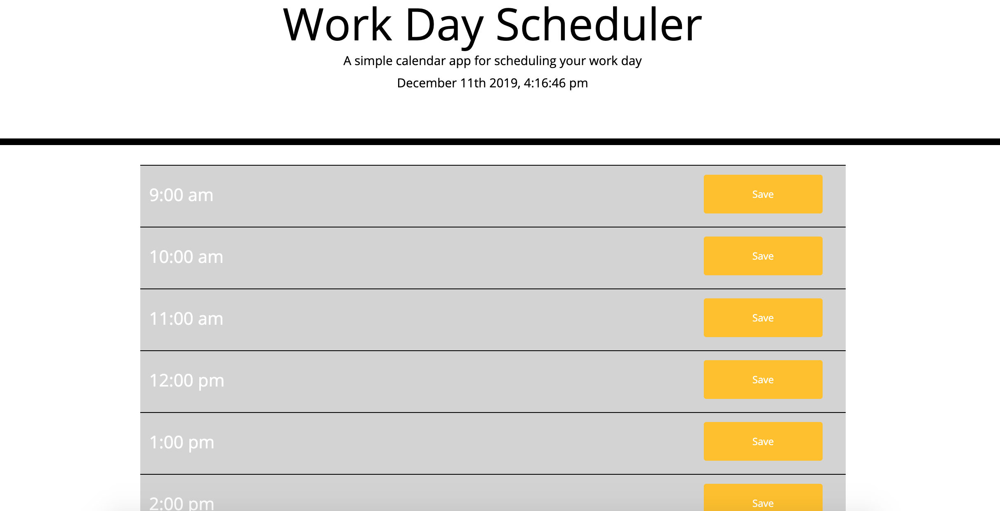
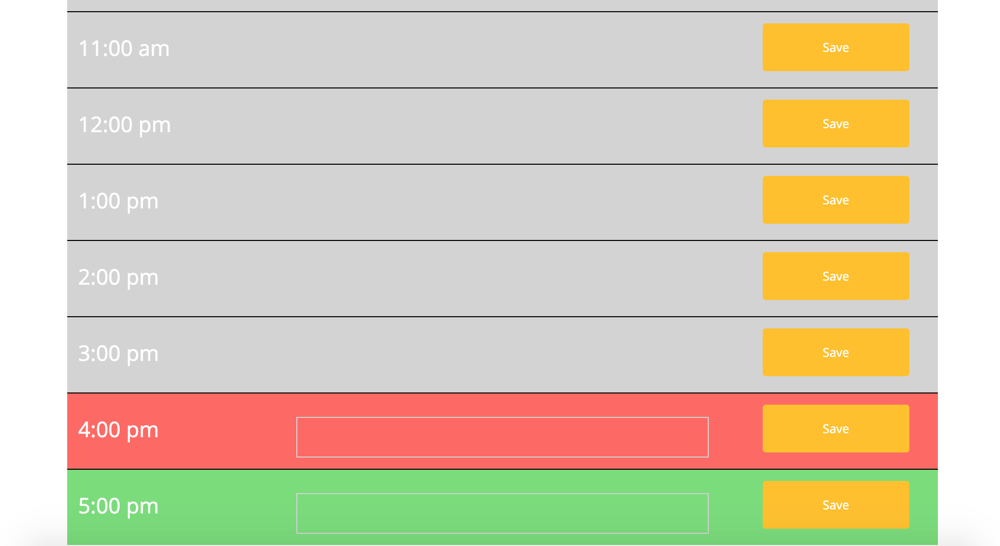

# Day Planner


## Introduction
Daily Planner keeps you organized from 9:00am to 5:00pm. It gives you real time so you know what time it is! It highlights past,present & future hour. Best thing of this daily planner is that it you accidently close the tab, you will still see what you gotta do!! Thanks Local Storage for that! 😉





## Code 
``` js
//current date & time displays
function minutes() {
  $("#currentDay").text(moment().format('MMMM Do YYYY, h:mm:ss a'));  
}
setInterval(minutes,1000);
```

``` js 
// highlights color
$(".saveBtn").each(function(i,data){
      console.log(i);
      console.log($(this).val());
      console.log(moment().hour());

      let exactHour = moment().hour();
      let valueHour = parseInt($(this).val());

      console.log(exactHour);
      console.log(valueHour);

      if (valueHour < exactHour) {
        $(".time" + i).addClass("past");
      } 
      else if (valueHour > exactHour) {
        $(".time" + i).addClass("future")
      } else {
        $(".time" + i).addClass("present")
      }
})
```

## Technologies
* HTML
* CSS
* Bootstrap
* JS
* JQuery
* Moment JS

## Instalation
1. On GitHub, navigate to the main page of the repository.
2. Under the repository name, click Clone or download.
3. To clone the repository, click "Clone with HTTPS".
4. Open Terminal.
5. Change the current working directory to the location where you want the cloned directory to be made.
6. Type git clone, and then paste the URL you copied in Step 2.
7. Press Enter. Your local clone will be created.

## Authors
* Lilliana Ramos

